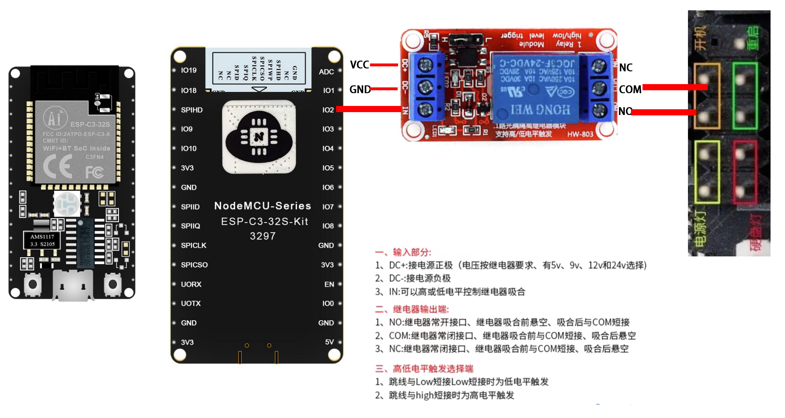
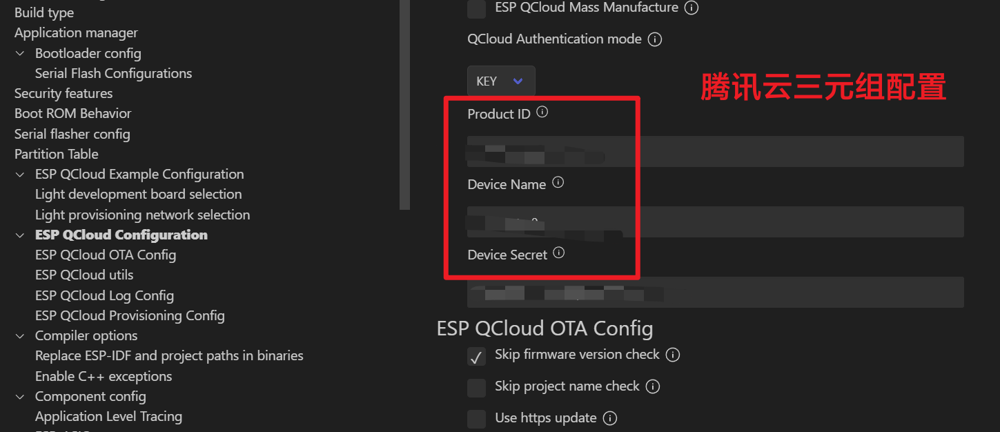
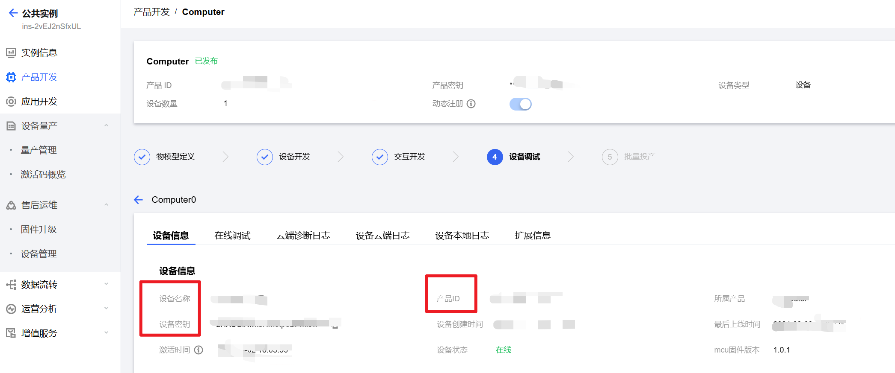

# 基于EPS32C3电脑远程开机模块设计


## 前言

缘起，手头资料太多了，所以想组一台NAS放在家里存储数据。在咸鱼淘了一套J3160主板加机箱，加上几块硬盘组建NAS。

对于NAS，我的需求是不用的时候关机(节省功耗)，要用的时候开机。

网上的开机棒太贵了。

还不如自己制作一个，趁暑假期间(没去实习好亏），刚好手头有一些之前本科毕设用剩下的ESP32C3模块。加上继电器就可以实现远程开机了。

云平台选择腾讯的物联开发平台。无他-因为有ESP32官方例程。


## 接线原理图

IO2--IN

COM--BN

NO--PowerSW

DC+--3V3

DC--GND。



## 代码

short_switch就是短按。短按开机。

long_switch就是长按。长按强制关机。

### GPIO初始化

继电器控制的引脚初始化。对于IO2。

```c
esp_err_t lgpio_init()
{
    //zero-initialize the config structure.
    gpio_config_t io_conf = {};
    //disable interrupt
    io_conf.intr_type = GPIO_INTR_DISABLE;
    //set as output mode
    io_conf.mode = GPIO_MODE_OUTPUT;
    //bit mask of the pins that you want to set,e.g.GPIO18/19
    io_conf.pin_bit_mask = GPIO_OUTPUT_PIN_SEL;
    //disable pull-down mode
    io_conf.pull_down_en = 0;
    //disable pull-up mode
    io_conf.pull_up_en = 0;
    //configure GPIO with the given settings
    gpio_config(&io_conf);
    return gpio_set_level(GPIO_OUTPUT_IO_0,1);
}
```

app_main.c初始化

```c

static esp_err_t example_driver_init(void)
{
    lightbulb_config_t config = {
        //1. Select and configure the chip
#ifdef CONFIG_LIGHTBULB_DEMO_DRIVER_SELECT_WS2812
        .type = DRIVER_WS2812,
        .driver_conf.ws2812.led_num = CONFIG_WS2812_LED_NUM,
        .driver_conf.ws2812.ctrl_io = CONFIG_WS2812_LED_GPIO,
#endif
#ifdef CONFIG_LIGHTBULB_DEMO_DRIVER_SELECT_PWM
        .type = DRIVER_ESP_PWM,
        .driver_conf.pwm.freq_hz = CONFIG_PWM_FREQ_HZ,
#ifdef CONFIG_IDF_TARGET_ESP32C2
        /* Adapt to ESP8684-DevKitM-1 
         * For details, please refer to: 
         * https://docs.espressif.com/projects/espressif-esp-dev-kits/zh_CN/latest/esp8684/esp8684-devkitm-1/user_guide.html
        */
        .driver_conf.pwm.invert_level = true,
#endif
#endif
#ifdef CONFIG_LIGHTBULB_DEMO_DRIVER_SELECT_SM2135E
        .type = DRIVER_SM2135E,
        .driver_conf.sm2135e.freq_khz = 400,
        .driver_conf.sm2135e.enable_iic_queue = true,
        .driver_conf.sm2135e.iic_clk = CONFIG_SM2135E_IIC_CLK_GPIO,
        .driver_conf.sm2135e.iic_sda = CONFIG_SM2135E_IIC_SDA_GPIO,
        .driver_conf.sm2135e.rgb_current = SM2135E_RGB_CURRENT_20MA,
        .driver_conf.sm2135e.wy_current = SM2135E_WY_CURRENT_40MA,
#endif
        // 2. Configure the drive capability
        .capability.enable_fades = true,
        .capability.fades_ms = 800,
        .capability.enable_status_storage = false,
        .capability.mode_mask = COLOR_MODE,
        .capability.storage_cb = NULL,

        //3. Configure driver io
#ifdef CONFIG_LIGHTBULB_DEMO_DRIVER_SELECT_PWM
        .io_conf.pwm_io.red = CONFIG_PWM_RED_GPIO,
        .io_conf.pwm_io.green = CONFIG_PWM_GREEN_GPIO,
        .io_conf.pwm_io.blue = CONFIG_PWM_BLUE_GPIO,
#endif
#ifdef CONFIG_LIGHTBULB_DEMO_DRIVER_SELECT_SM2135E
        .io_conf.iic_io.red = OUT3,
        .io_conf.iic_io.green = OUT2,
        .io_conf.iic_io.blue = OUT1,
        .io_conf.iic_io.cold_white = OUT5,
        .io_conf.iic_io.warm_yellow = OUT4,
#endif
        //4. Limit param
        .external_limit = NULL,

        //5. Gamma param
        .gamma_conf = NULL,

        //6. Init param
        .init_status.mode = WORK_COLOR,
        .init_status.on = false,
        .init_status.short_on = false,
        .init_status.long_on = false,
        .init_status.hue = 0,
        .init_status.saturation = 100,
        .init_status.value = 100,


    };
    return lightbulb_init(&config);
}

```


### 控制继电器开闭

简单的控制继电器的操作，通过输出引脚低电平控制继电器闭合。

```c
esp_err_t lightbulb_set_short_switch(bool status)
{
    esp_err_t err = ESP_OK;
    LIGHTBULB_MUTEX_TAKE(portMAX_DELAY);
    s_lb_obj->status.short_on = status;
    if (status == true){
        gpio_set_level(GPIO_OUTPUT_IO_0,0);
        vTaskDelay(1500 / portTICK_RATE_MS);
        gpio_set_level(GPIO_OUTPUT_IO_0,1);
        s_lb_obj->status.short_on = !status;
    }
    LIGHTBULB_MUTEX_GIVE();
    return err;
}

esp_err_t lightbulb_set_long_switch(bool status)
{
    esp_err_t err = ESP_OK;
    LIGHTBULB_MUTEX_TAKE(portMAX_DELAY);
    s_lb_obj->status.short_on = status;
    if (status == true){
        gpio_set_level(GPIO_OUTPUT_IO_0,0);
        vTaskDelay(15000 / portTICK_RATE_MS);
        gpio_set_level(GPIO_OUTPUT_IO_0,1);
        s_lb_obj->status.short_on = !status;
    }
    LIGHTBULB_MUTEX_GIVE();
    return err;
}

```


### 获取腾讯云指令按钮的值

```c
bool lightbulb_get_short_switch(void)
{
    LIGHTBULB_CHECK(s_lb_obj, "not init", return ESP_ERR_INVALID_ARG);
    LIGHTBULB_MUTEX_TAKE(portMAX_DELAY);
    bool result = s_lb_obj->status.short_on;
    LIGHTBULB_MUTEX_GIVE();
    return result;
}

bool lightbulb_get_long_switch(void)
{
    LIGHTBULB_CHECK(s_lb_obj, "not init", return ESP_ERR_INVALID_ARG);
    LIGHTBULB_MUTEX_TAKE(portMAX_DELAY);
    bool result = s_lb_obj->status.long_on;
    LIGHTBULB_MUTEX_GIVE();
    return result;
}

```


### 任务切换逻辑

1. 获取腾讯云参数后进入相应的函数。

2. 设置继电器引脚--控制继电器通。

3. 设置继电器引脚--控制继电器断。

4. 更新按钮的状态。

5. 将值写回参数上传回腾讯云。

```c

/* Callback to handle commands received from the QCloud cloud */
static esp_err_t light_get_param(const char *id, esp_qcloud_param_val_t *val)
{
    if (!strcmp(id, "power_switch")) {
        val->b = lightbulb_get_switch();
    } else if (!strcmp(id, "value")) {
        val->i = lightbulb_get_value();
    } else if (!strcmp(id, "hue")) {
        val->i = lightbulb_get_hue();
    } else if (!strcmp(id, "saturation")) {
        val->i = lightbulb_get_saturation();
    } else if (!strcmp(id, "comp_switch_s")) {
        val->b = lightbulb_get_short_switch();
    } else if (!strcmp(id, "comp_switch_l")) {
        val->b = lightbulb_get_long_switch();
    }

    ESP_LOGI(TAG, "Report id: %s, val: %d", id, val->i);

    return ESP_OK;
}

/* Callback to handle commands received from the QCloud cloud */
static esp_err_t light_set_param(const char *id, const esp_qcloud_param_val_t *val)
{
    esp_err_t err = ESP_FAIL;
    ESP_LOGI(TAG, "Received id: %s, val: %d", id, val->i);

    if (!strcmp(id, "power_switch")) {
        err = lightbulb_set_switch(val->b);
    } else if (!strcmp(id, "value")) {
        err = lightbulb_set_value(val->i);
    } else if (!strcmp(id, "hue")) {
        err = lightbulb_set_hue(val->i);
    } else if (!strcmp(id, "saturation")) {
        err = lightbulb_set_saturation(val->i);
    } else if (!strcmp(id, "comp_switch_s")) {
        err = lightbulb_set_short_switch(val->b);
    } else if (!strcmp(id, "comp_switch_l")) {
        err = lightbulb_set_long_switch(val->b);
    } 
    
    else {
        ESP_LOGW(TAG, "This parameter is not supported");
    }

    /* Report driver changes to the cloud side */
    esp_qcloud_iothub_report_all_property();
    return err;
}

```

### 腾讯云三元组配置




安装云平台的内容一一对应填入。



### 更改数据模板

添加数据模板

```json
{
	"version": "1.0",
	"profile": {
		"ProductId": "65BEMES9XM",
		"CategoryId": "141"
	},
	"properties": [{
		"id": "power_switch",
		"name": "电灯开关",
		"desc": "控制电灯开灭",
		"required": true,
		"mode": "rw",
		"define": {
			"type": "bool",
			"mapping": {
				"0": "关",
				"1": "开"
			}
		}
	}, 
	{
		"id": "comp_switch_s",
		"name": "电脑开关点按",
		"desc": "电脑开关机点按",
		"required": true,
		"mode": "rw",
		"define": {
			"type": "bool",
			"mapping": {
				"0": "关",
				"1": "开"
			}
		}
	},
	{
		"id": "comp_switch_l",
		"name": "电脑开关长按",
		"desc": "电脑开关机长按",
		"required": true,
		"mode": "rw",
		"define": {
			"type": "bool",
			"mapping": {
				"0": "关",
				"1": "开"
			}
		}
	},
	{
		"id": "saturation",
		"name": "饱和度",
		"desc": "",
		"mode": "rw",
		"define": {
			"type": "int",
			"min": "0",
			"max": "100",
			"start": "0",
			"step": "1",
			"unit": ""
		},
		"required": false
	}, {
		"id": "value",
		"name": "明度",
		"desc": "",
		"mode": "rw",
		"define": {
			"type": "int",
			"min": "0",
			"max": "100",
			"start": "0",
			"step": "1",
			"unit": ""
		},
		"required": false
	}, {
		"id": "hue",
		"name": "色调",
		"desc": "",
		"mode": "rw",
		"define": {
			"type": "int",
			"min": "0",
			"max": "360",
			"start": "0",
			"step": "1",
			"unit": ""
		},
		"required": false
	}],
	"events": [{
		"id": "hardware_fault",
		"name": "Hardware_fault",
		"desc": "Report hardware fault",
		"type": "fault",
		"required": false,
		"params": [{
			"id": "name",
			"name": "Name",
			"desc": "Name like: memory,tf card, censors ...",
			"define": {
				"type": "string",
				"min": "0",
				"max": "64"
			}
		}, {
			"id": "error_code",
			"name": "Error_Code",
			"desc": "Error code for fault",
			"define": {
				"type": "int",
				"unit": "",
				"step": "1",
				"min": "0",
				"max": "2000",
				"start": "1"
			}
		}]
	}],
	"actions": []
}

```


## 后记

没时间折腾，直接更改EPS32的官方例程。

仅仅添加了几行代码实现了想要的工程。

原理很简单，代码写得也很简陋，仅供参考。

等有空了(大概率没空），后续添加电脑状态识别(Power LED+和Power LED-)，接入引脚读取电平。
